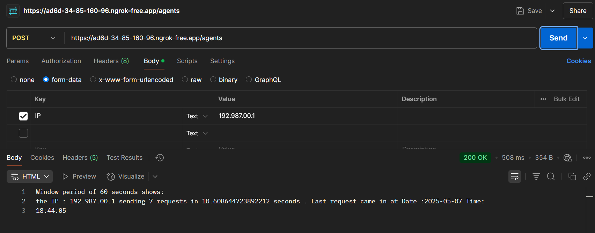

#  Nikhil's Progress 

1. Setup Server for API using flask and deployed it as a public URL using **ngrok**

## Setting up Context for DDOS Agent specifically 

- Created a tool for capturing Global metrics within a pre-defined window ( for example capturing the numbers of requests from a certail IP within a period of 60 seconds , as context for the LLM and parameters for the deep learning model ) 

