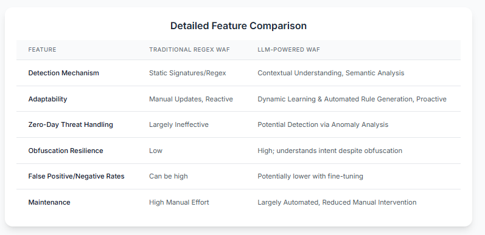

# Beyond Regex: How LLMs are Revolutionizing WAF Rule Generation

## I. Introduction: The Shifting Sands of API Security

APIs are the backbone of modern software, now constituting over 57% of Internet traffic.¹ This rapid expansion, while fostering innovation, has significantly broadened the attack surface. Many organizations struggle with "shadow APIs" operating outside security oversight, with studies showing machine learning identifying a third more API endpoints than self-reported.¹ Consequently, a majority of organizations have faced API security incidents, often due to common vulnerabilities.² In this "API-centric world," API security is a critical business imperative.

Simultaneously, cyber threats are becoming more sophisticated, frequently augmented by AI.³ Attackers use AI to automate and scale their efforts, with searches for "AI cyber attacks" increasing by 186% in two years.⁵ AI can generate novel malware and craft convincing phishing emails, creating an "asymmetric warfare" scenario where traditional, static defenses struggle to keep pace.⁵

Web Application Firewalls (WAFs) have been a primary defense, traditionally relying on signatures and regular expressions (regex) to block malicious traffic.⁴ However, this signature-based approach is strained by modern, intelligent threats, necessitating a shift towards more proactive and intelligent WAFs.⁴

## II. The Old Guard: Limitations of Regex-Based WAFs

Traditional WAFs, like ModSecurity, inspect web traffic against predefined rules, often regex, to identify known attack patterns such as SQL injection (SQLi) or Cross-Site Scripting (XSS).⁴ While valuable, this method has significant limitations:

* **Reactive and Limited to Known Threats:** They are effective only against attacks matching existing signatures, leaving them vulnerable to new and zero-day exploits.⁴
* **Vulnerability to Bypass Techniques:** Attackers use encoding, obfuscation, HTTP parameter pollution, and slight attack modifications to evade regex-based detection, which struggles with syntactic variations rather than malicious intent.⁶
* **High False Positive Rates & Operational Burden:** Overly broad rules can block legitimate traffic, causing user disruption and alert fatigue. Maintaining and updating rule sets is a continuous, resource-intensive effort.⁴
* **Limited Scope and Contextual Understanding:** Traditional WAFs focus on Layer 7 traffic and often lack deep understanding of application logic, making them less effective against business logic flaws or multi-step attacks.⁶
* **False Sense of Security:** Overreliance on WAFs can lead organizations to neglect other crucial security measures.⁶

## III. The LLM Revolution: Intelligent, Adaptive WAF Rule Generation

Large Language Models (LLMs) offer a paradigm shift from regex-based WAFs. LLMs, built on deep-learning architectures, can process, understand, and generate human-like text and code, grasping context and subtle nuances far beyond simple pattern matching.⁸

Key LLM characteristics beneficial for WAFs:

* **Contextual Understanding:** LLMs analyze requests in broader context, identifying malicious intent even when disguised.⁹
* **Advanced Pattern Recognition:** Trained on vast datasets, LLMs can identify complex attack vectors missed by signatures.⁹
* **Adaptability and Fine-Tuning:** LLMs can be fine-tuned on domain-specific data (e.g., attack logs) to become expert detectors for threats like SQLi and XSS.⁸ The quality of this fine-tuning data is crucial.¹²

For SQLi and XSS, fine-tuned LLMs (like DistilBERT, ALBERT, or ArmoRM-Llama3-8B) demonstrate high accuracy, even with obfuscated or multi-label attacks, by understanding the complex structure of SQL or JavaScript.¹¹ LLMs can also generate sophisticated XSS payloads to test defenses and train themselves to create effective blocking rules, a significant advantage against obfuscated attacks where traditional ML struggles without extensive specific training.⁸ LLM-generated obfuscated samples have been shown to be more complex and diverse, enhancing model robustness.¹³

Dynamic rule generation is a core LLM capability. When an LLM detects a new threat, it can automatically analyze it and generate a specific WAF rule to block it and similar future attempts, creating an "Adaptive Defense".⁸ For instance, the GenXSS framework using GPT-4o blocked 86% of previously successful XSS attacks with only 15 new rules, indicating LLM-generated rules are more semantically potent and efficient.⁸ LLM-driven vulnerability assessment can also reduce false negatives by an average of 30%.¹²

### Traditional Regex WAFs vs. LLM-Powered WAFs

## IV. Zapisec: Pioneering the Next Generation of API Defense

Zapisec, a Unified LLM-Based API Security Framework, embodies these LLM advancements. It employs a multi-layered defense with specialized sub-agents, orchestrated by an intelligent, deep learning-based pipeline.¹⁵

Incoming traffic is processed by a central API Server, then a Preprocessing and Tokenization module standardizes data and tracks global traffic characteristics for contextual awareness. This enriched data feeds an advanced Traffic Classifier, which triages requests as Normal, DDoS, or Bot.

The Zapisec WAF Agent, for traffic not initially flagged, uses a fine-tuned LLM ("Fire Wall-Model") for deep inspection against threats like XSS, SQLi, and path traversal.¹¹ If a threat is detected, a "Rule Generation component" creates a specific, tailored rule, similar to research like GenXSS.⁸ A "Rule-Model" then summarizes this rule before blocking the request, offering transparency.

Zapisec's WAF is part of a holistic ecosystem:

* **DDoS and Bot Agents** use specialized LLMs for dynamic rule generation.
* An **Anomaly Detection Agent** monitors for unusual patterns indicative of emerging threats.

This multi-agent architecture allows for highly specialized LLM fine-tuning, likely achieving superior efficacy for each threat category.¹² Zapisec's dynamic, adaptive nature and automated rule generation directly address traditional WAF shortcomings, reducing manual effort and improving responsiveness.

## V. Embracing the Future: Why LLM-Powered WAFs are Non-Negotiable

In the current "AI vs. AI" cybersecurity landscape, where attackers leverage AI for sophisticated attacks⁵, relying on traditional defenses is insufficient. LLM-powered WAFs, like those in Zapisec, are becoming essential.⁴

Benefits include:

* **Proactive and Predictive Security:** LLMs can identify potential vulnerabilities or emerging attack patterns before full materialization, and even suggest preemptive fixes.⁴ This also allows security teams to upskill by focusing on strategic tasks.¹²
* **Superior Protection Against Evolving Threats:** Enhanced capability against zero-day exploits and obfuscated payloads.⁸
* **Reduced Operational Overhead & Alert Fatigue:** Automation of rule generation and adaptation lessens the burden on security teams.⁴
* **Increased Accuracy and Lower False Positives/Negatives:** Better differentiation between malicious traffic and benign anomalies due to contextual understanding.¹¹
* **Enhanced Resilience through Continuous Evolution:** Systems continuously learn and adapt, strengthening security over time without constant manual intervention, moving towards more autonomous cyber defense.⁴ Transparency and explainability in these AI systems will be crucial.¹²

## VI. Conclusion: Secure Your APIs with Intelligent Defense

Traditional regex-based WAFs are ill-equipped for today's dynamic threat environment. LLMs offer the intelligence, contextual awareness, and adaptability to revolutionize WAF rule generation, enabling WAFs to understand malicious intent, not just syntax.

In an API-driven world with AI-armed adversaries, intelligent, LLM-based security solutions like Zapisec are vital. Embracing these technologies provides a significantly enhanced security posture and a competitive edge, allowing businesses to innovate faster and more confidently by reducing security-related friction.²

The future of API security is intelligent and adaptive. It's time to move beyond outdated defenses.

Discover the future of API security. Visit [Zapisec Website/Contact Link] to learn more or schedule a personalized demonstration.

---

### Works cited

1.  *2024 API Security and Management Report* - Cloudflare, accessed on June 11, 2025, https://www.cloudflare.com/2024-api-security-management-report/
2.  *99% of Organizations Report API-Related Security Issues* - Infosecurity Magazine, accessed on June 11, 2025, https://www.infosecurity-magazine.com/news/99-organizations-report-api/
3.  *Threat Actors Turn to AI and LLM Tools for Launching Offensive Cyber Attacks*, accessed on June 11, 2025, https://cyberpress.org/threat-actors-turn-to-ai-and-llm-tools/
4.  *CDN WAFs in the Age of AI: Facing the Evolving Threat Landscape ...*, accessed on June 11, 2025, https://bizety.com/2025/01/25/cdn-wafs-in-the-age-of-ai-facing-the-evolving-threat-landscape/
5.  *7 AI Cybersecurity Trends For The 2025 Cybercrime Landscape* - Exploding Topics, accessed on June 11, 2025, https://explodingtopics.com/blog/ai-cybersecurity
6.  *The Illusion of Security: Why Relying Solely on WAF is a Bad ...*, accessed on June 11, 2025, https://www.brightsec.com/blog/the-illusion-of-security-why-relying-solely-on-waf-is-a-bad-practice/
7.  *Is Reuse All You Need? A Systematic Comparison of Regular Expression Composition Strategies* - arXiv, accessed on June 11, 2025, https://arxiv.org/html/2503.20579v1
8.  *GenXSS: an AI-Driven Framework for Automated Detection of XSS Attacks in WAFs* - arXiv, accessed on June 11, 2025, https://arxiv.org/html/2504.08176v1
9.  *GenXSS: an AI-Driven Framework for Automated Detection of XSS Attacks in WAFs*, accessed on June 11, 2025, https://www.researchgate.net/publication/390749273_GenXSS_an_AI-Driven_Framework_for_Automated_Detection_of_XSS_Attacks_in_WAFs
10. *Large Language Models for Cybersecurity: The Role of LLMs in Threat Hunting* - Bolster AI, accessed on June 11, 2025, https://bolster.ai/blog/large-language-models-cybersecurity
11. *Fine-Tuning Transformer LLMs for Detecting SQL ...* - ManuscriptLink, accessed on June 11, 2025, https://www.manuscriptlink.com/society/kics/media?key=kics/conference/icaiic2025/presentation/1571099636.pdf
12. *LLMs in Cybersecurity: Understanding Threats and Solutions* - Qualys Blog, accessed on June 11, 2025, https://blog.qualys.com/product-tech/2025/02/07/the-impact-of-llms-on-cybersecurity-new-threats-and-solutions
13. *Leveraging LLM to Strengthen ML-Based Cross-Site Scripting Detection* - arXiv, accessed on June 11, 2025, https://arxiv.org/html/2504.21045v1
14. *Leveraging LLM to Strengthen ML-Based Cross-Site Scripting Detection* - arXiv, accessed on June 11, 2025, https://arxiv.org/pdf/2504.21045
15. *ZAPISEC | HackerNoon*, accessed on June 11, 2025, https://hackernoon.com/u/contact@cyberultron.com
16. *Top 9 LLM Security Best Practices* - Check Point Software, accessed on June 11, 2025, https://www.checkpoint.com/cyber-hub/what-is-llm-security/llm-security-best-practices/