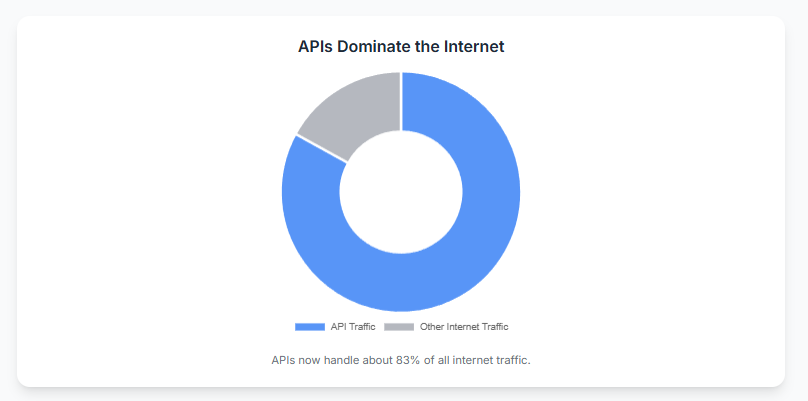
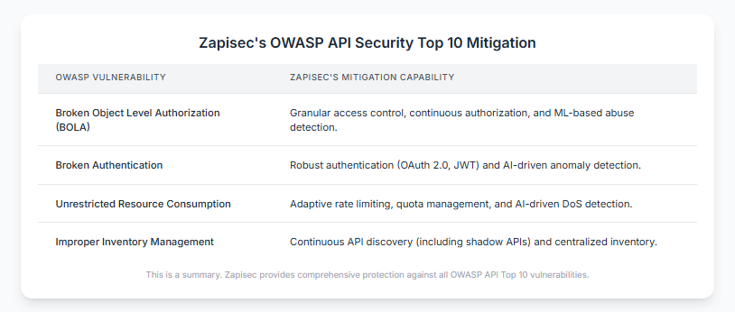
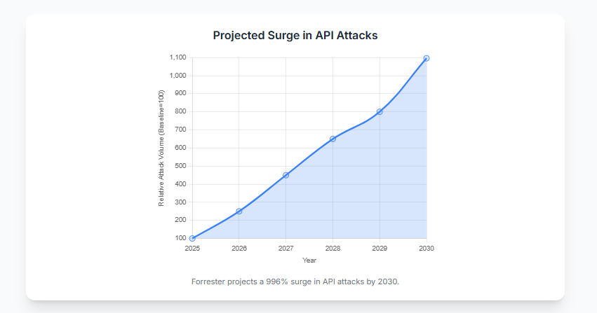
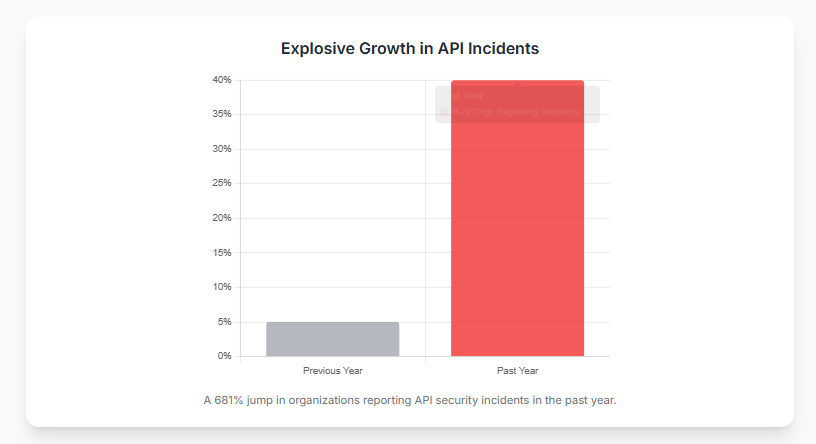
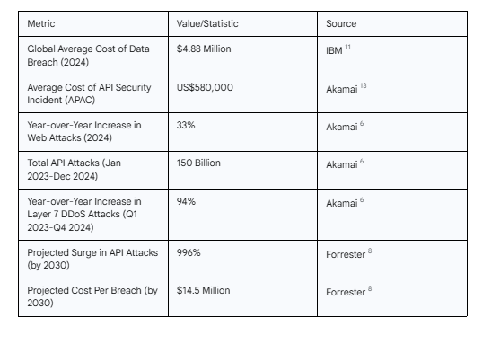
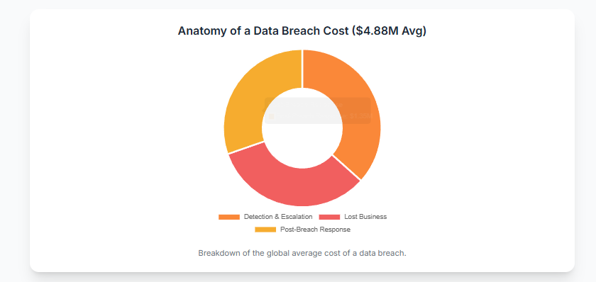

# The Cost of Inaction: Why Your Legacy API Security Can't Keep Up with Modern Threats

## I. The Looming Crisis: Why Your Legacy API Security is a Ticking Time Bomb

### Introduction: The Critical Role of APIs and the Growing Threat

APIs are the invisible backbone of modern digital infrastructure, facilitating communication across applications, cloud services, and devices, handling "about 83% of all internet traffic".¹ This makes them a prime target for malicious actors. The threat landscape is rapidly escalating, with "40% of organizations reported API security incidents in the past year—a staggering 681% jump from previous figures".² This surge indicates attackers are strategically targeting APIs as a high-value, vulnerable vector. Organizations must shift their security focus from network boundaries to API endpoints, as traditional perimeter defenses are no longer sufficient.

### The Inadequacy of Traditional Defenses: Architectural Limitations and Static Rules

Legacy security solutions like traditional firewalls and Web Application Firewalls (WAFs) are ill-equipped for modern API traffic. They "often lack the granular visibility needed to protect APIs effectively, frequently missing low-and-slow API attacks"³ and struggle with API-specific nuances like business logic and data structures. WAFs rely on "static, rule-based filtering"⁴, making them reactive and unable to keep pace with evolving threats and zero-day vulnerabilities.

Traditional security also often assumes internal traffic is benign, but "static IP-based trust models... fail against compromised credentials and insider threats".³ Furthermore, "modern API threats go beyond brute-force attacks and credential stuffing. Attackers now exploit business logic flaws, hidden API exposures, and unmonitored third-party integrations—areas that traditional API security tools fail to detect".³ These sophisticated attacks often mimic legitimate traffic, requiring a shift to behavioral analysis.

The contrast between legacy and modern API security approaches is stark:

## II. The New Battlefield: Understanding Modern API Threats

### The Evolution of Attacks: From Volume to Sophistication

Cyberattacks have shifted from overwhelming volume to highly sophisticated, targeted strategies. Attackers now use "simultaneous attacks on multiple destination IPs (horizontal DDoS attacks), the use of simultaneous multiple attack vectors, and the use of AI-enabled tools"⁵ to find and exploit weaknesses. Almost all DDoS attacks in 2024 employed multiple, rapidly evolving attack vectors.⁵

Artificial Intelligence (AI) is a powerful weapon for cybercriminals, making it "relatively easy and inexpensive for attackers to scale up the size of DDoS attacks"⁵ and launch "sophisticated bot-driven attacks"⁶ for data scraping, password guessing, or exploiting authorization gaps.² While AI-powered coding assistants accelerate API creation, they can also introduce security risks⁷, expanding the attack surface faster than security teams can track.⁷ This creates an AI-vs-AI arms race in security.

### Beyond the Basics: Emerging Vulnerabilities and API Sprawl

A major blind spot is "dark APIs"—undocumented, forgotten, or unmanaged APIs. Gartner highlights "the growing risks from undocumented and misconfigured APIs, including “rogue” and “zombie” APIs".⁷ Attackers actively "scan for abandoned APIs, exploiting outdated security policies or weaker authentication mechanisms".³ "Many organizations have “shadow APIs” that aren't under the control... of the IT department"¹, with "only 10% of organizations fully document their APIs".⁸ This "improper inventory management"⁹ creates massive blind spots, underscoring the need for continuous API discovery.

Despite awareness, "OWASP API Security Top 10–related incidents increased 32%"⁶, revealing persistent authentication and authorization flaws. Common vulnerabilities include Missing Authentication, Injection Attacks, Broken Object Level Authorization (BOLA), Broken Authentication, and Unrestricted Resource Consumption.¹⁰ BOLA and Broken Function Level Authorization (BFLA)⁹ are particularly insidious as they allow attackers to use valid sessions to access unauthorized data or functions by manipulating object IDs or endpoints, often bypassing traditional WAFs.

## III. The True Cost of Inaction: Beyond the Breach

### Direct Financial Impact: The Immediate Fallout

The financial impact of API security breaches is staggering. The "global average cost of a data breach reached $4.88 million"¹¹, including "costs for detection and escalation ($1.63 million), lost business ($1.47 million), and post-breach response costs ($1.35 million)".¹² API security incidents alone cost "APAC enterprises Over US$580,000 on Average in the Past Year".¹³ These costs extend to crisis management, customer notification, investigation, remediation, legal fees, and regulatory fines.¹² A "disconnect between risk and response"¹³ exists, with C-suite executives underestimating costs compared to front-line staff¹³, leading to under-investment.

The escalating nature of API security incidents and their associated costs:

### Indirect Business Consequences: Long-Term Damage and Erosion of Value

Beyond direct costs, API breaches "severely damage a company's reputation, making it difficult to attract new customers and retain existing ones"¹¹, leading to "decreased loyalty and potential churn".¹¹ This erosion of trust can have lasting negative effects on revenue and market share. Breaches also cause "downtime, lost productivity and risks to supply chains".¹¹ The "attack against operational technology... when the Sandworm hacker group launched an attack on Ukraine's power grid"¹¹ shows how API vulnerabilities can impact critical infrastructure. Stolen trade secrets or proprietary data can undermine competitive advantage and innovation.¹²

### Regulatory and Compliance Penalties: The Heavy Hand of the Law

Failing to secure APIs results in significant legal and regulatory repercussions. "Non-compliance with data protection regulations such as the General Data Protection Regulation (GDPR) can result in significant fines and legal repercussions".¹¹ British Airways faced a "record £20 million fine"¹¹ due to an API vulnerability. Under GDPR, fines can reach "€20 million or 4% of annual global turnover"¹², and CCPA penalties "$7,500 per violation".¹² "API-related incidents are no longer considered isolated technical issues. They are compliance failures with regulatory consequences"⁵, making proactive security a legal and financial necessity.

Forrester predicts "API Attacks are estimated to surge 996% by 2030 — with the cost per breach rising... to $14.5 million".⁸ This means delaying investment in modern API security actively compounds future risk and financial liability.

## IV. Zapisec: Your Proactive Shield Against Tomorrow's Threats

### Bridging the Gap: How Zapisec Addresses the Limitations of Legacy Systems

Zapisec moves beyond static, reactive approaches of traditional firewalls and WAFs, which "often fail to address API-specific threats"³ and "struggle with the complexities of modern applications".⁸ Zapisec is API-native, purpose-built to understand API protocols, data formats, and business logic at a deep, contextual level. It provides the "granular visibility," "real-time behavioral analysis," and "proactive approach" that legacy systems lack.³

### Key Capabilities: Intelligent, Continuous, and Comprehensive Protection

Zapisec leverages advanced AI and ML to detect sophisticated threats, crucial for identifying evasive "low-and-slow API attacks"³ and adapting to "evolving cyber threats".⁴ It uses "Real-time behavioral analysis to detect abnormal API usage patterns" and "AI-driven anomaly detection"³, moving beyond static thresholds to intelligent "behavioral rate limiting".³ As attackers use AI⁵, Zapisec's AI/ML capabilities are essential for real-time detection and response.

Zapisec directly addresses "API sprawl" and "shadow APIs"¹ with "continuous API discovery" and "centralized API inventory and governance"¹, ensuring full visibility into the entire API ecosystem, including "undocumented and misconfigured APIs".⁷ This transforms unknown risks into manageable assets.

Zapisec provides automated blocking of suspicious API clients³ and real-time protection against a wide range of attacks.⁹ It mitigates critical OWASP API Security Top 10 vulnerabilities, including Broken Object Level Authorization (BOLA), Broken Authentication, Unrestricted Resource Consumption, and Security Misconfiguration.⁹ This includes robust authentication, granular authorization, stringent input validation, and adaptive rate limiting.²

Zapisec's comprehensive approach to mitigating the OWASP API Security Top 10 vulnerabilities:

### Aligning with Modern Security Principles: Zero-Trust and Shift-Left

Zapisec aligns with Zero-Trust principles, enforcing "least privilege access controls" and "continuous authentication and authorization for every API call".³ This ensures no entity is trusted by default, providing resilience against compromised credentials and insider threats.

By integrating security earlier, Zapisec supports "automated repository scanning" and "material code change detection".⁷ This "shift-left" approach "reduce[s] API risk by embedding security earlier in the development lifecycle"⁷, preventing vulnerabilities from proliferating and reducing remediation costs.

## V. Act Now: Securing Your Digital Future with Zapisec

### The Imperative for Modernization: Why Waiting is No Longer an Option

The data is clear: "API Attacks are estimated to surge 996% by 2030 — with the cost per breach rising... to $14.5 million".⁸ This accelerating crisis demands immediate action. The "critical gap between perception and reality"¹⁴ means many organizations are dangerously unprepared. Relying on "outdated cybersecurity solutions"⁸ like traditional WAFs leaves businesses vulnerable. Delaying investment in modern API security actively compounds future risk.

### A Call to Action: Embrace Proactive, Intelligent API Security

To mitigate escalating threats and avoid catastrophic consequences, organizations must adopt a "holistic API security program".¹⁵ "Forrester identifies API security as a critical area requiring substantial investment in 2025".⁸ It's time to move beyond legacy systems and embrace a solution designed for the complex, intelligent, and rapidly evolving modern threat landscape. Zapisec offers the necessary "AI-driven, self-healing, proactive" capabilities³ to secure your digital future.

---

### Works cited
1. Boomi's Point of View: Gartner Hype Cycle for APIs, 2024, accessed on June 18, 2025, https://boomi.com/blog/api-strategy-vs-hype/
2. The Essential API Security Checklist - Jit.io, accessed on June 18, 2025, https://www.jit.io/resources/app-security/the-essential-api-security-checklist
3. API Gateway Security Best Practices - AppSentinels, accessed on June 18, 2025, https://appsentinels.ai/blog/api-gateway-security-best-practices/
4. Are WAFs Obsolete? Pros, Cons, and What the Future Holds | Tripwire, accessed on June 18, 2025, https://www.tripwire.com/state-of-security/are-wafs-obsolete-pros-cons-and-what-future-holds
5. DDoS Attack Trends in 2024 Signify That Sophistication Overshadows Size | Akamai, accessed on June 18, 2025, https://www.akamai.com/blog/security/ddos-attack-trends-2024-signify-sophistication-overshadows-size
6. Akamai Research: Web Attacks Up 33%, APIs Emerge as Primary Targets, accessed on June 18, 2025, https://www.akamai.com/newsroom/press-release/akamai-research-web-attacks-up-33-apis-emerge-as-primary-targets
7. Gartner: AI Development Is Fueling API Security Risks | Apiiro, accessed on June 18, 2025, https://apiiro.com/blog/api-security-gartner-ai-development/
8. Forrester's CISO Budget Planning Guide for 2025: Prioritize API Security - Escape.tech, accessed on June 18, 2025, https://escape.tech/blog/forresters-ciso-budget-planning-guide-for-2025-api-security/
9. Protecting your APIs from OWASP's top 10 security threats | Google Cloud Blog, accessed on June 18, 2025, https://cloud.google.com/blog/products/identity-security/protecting-your-apis-from-owasps-top-10-security-threats
10. Top 8 API Vulnerabilities and How to Mitigate Them - Pynt, accessed on June 18, 2025, https://www.pynt.io/learning-hub/api-security-guide/top-8-api-vulnerabilities-and-how-to-mitigate-them
11. The True Cost of API Security Breaches: Examples, Consequences & Prevention, accessed on June 18, 2025, https://blog.seeburger.com/the-true-cost-of-api-security-breaches-examples-consequences-prevention/
12. The Financial Implications of a Security Breach: Costs, Risks, and Prevention, accessed on June 18, 2025, https://www.genesesolution.com/blog/financial-implications-of-a-security-breach/
13. New Akamai Study Reveals API Security Incidents Cost APAC Enterprises Over US$580000 on Average in the Past Year, accessed on June 18, 2025, https://www.akamai.com/newsroom/press-release/2025-api-security-impact-study
14. API security incidents cost APAC firms over US$580K on average | Frontier Enterprise, accessed on June 18, 2025, https://www.frontier-enterprise.com/api-security-incidents-cost-apac-firms-over-us580000-on-average/
15. Free Forrester API Security Report Download | F5, accessed on June 18, 2025, https://www.f5.com/go/ebook/forrester-report-the-eight-components-of-api-security