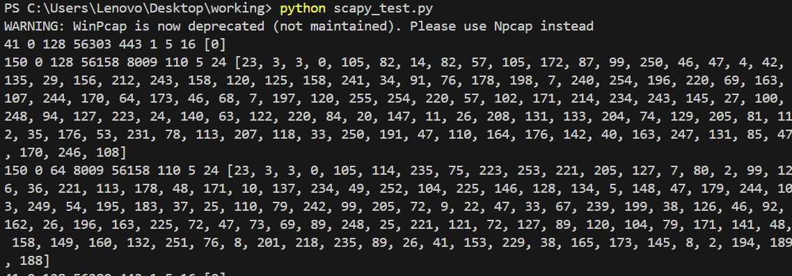

## Nikhil's Progress 
- Researched on how to build a tool to capture realtime network packets to send to the Deep learning model 
- learnt how to use Scapy for network packet sniffing and capture from docs 
- used scapy to build a custom network packet capture tool that convert raw packet data into the expected input format for the model 

- researched hugging face for models to use for the attack detection , and found DistillBERTSequence classifier 
- currently working on using the Distill BERT model 
- Ran into issues with respect to a particular module's ( tensorflow ) dependencies , working on resolving that right now 
- Also Need some time to Develop and train the model 

- Found a dataset for 1.5 million records of packets classfied into the following attacks:
```
['Analysis',
 'Backdoor',
 'Bot',
 'DDoS',
 'DoS',
 'DoS GoldenEye',
 'DoS Hulk',
 'DoS SlowHTTPTest',
 'DoS Slowloris',
 'Exploits',
 'FTP Patator',
 'Fuzzers',
 'Generic',
 'Heartbleed',
 'Infiltration',
 'Normal',
 'Port Scan',
 'Reconnaissance',
 'SSH Patator',
 'Shellcode',
 'Web Attack - Brute Force',
 'Web Attack - SQL Injection',
 'Web Attack - XSS',
 'Worms']
```

- will require time to train the model in batches because only have limited computing resources 
- upon research, have decided to train the model on Google Colab in batches as a base configuration has 12GB of RAM and 107GB storage , and will then upload the model to huggingface . After which the trained model can be used on the local machine 
- UPDATE : resolved issues with model compatibilty with dataset and begun training in google colab 


Requirements as of now :
- openAi credits of 100$ ( discussed with pratul and he recommended we use this much amount for now , only to build the proof of concept model )
- time to develop and build the model and format the dataset to a "model-readable" format 
- access to google colab pro if possible , to train the models there 
