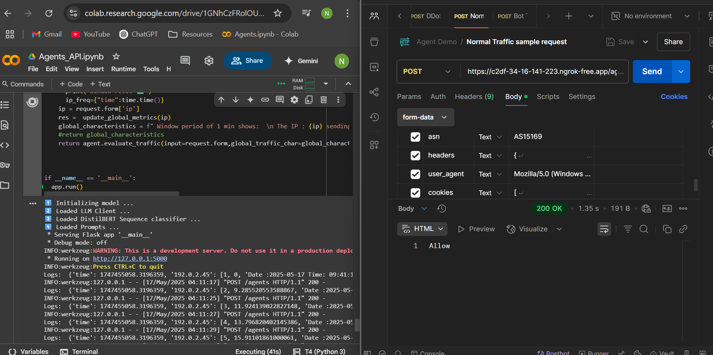
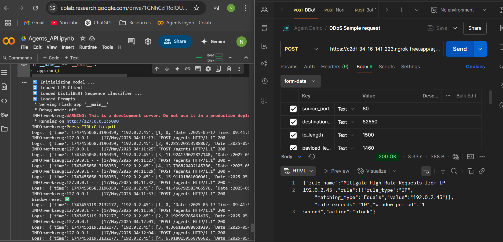
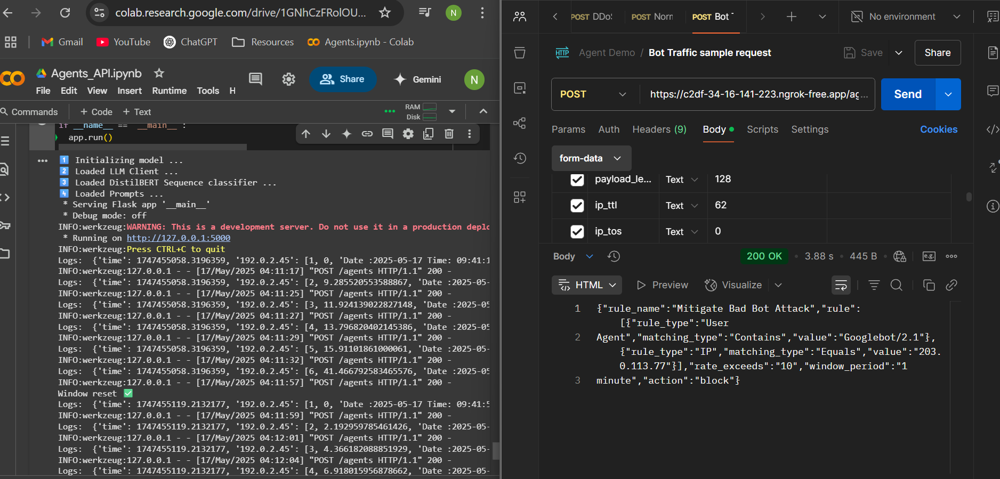

# Nikhil's Progress :

- API Development complete for building an MVP 
- started testing on Sample mock data since Real dataset isnt avaibale and **Created a Demo** . 

## Demo 

### Normal Traffic Demo Request  
- Average Response Latency = 1.08 s 
- Request : 
```
{
  "Source_Port": 80,
  "Destination_Port": 50128,
  "IP_Length": 2960,
  "Payload_Length": 2920,
  "IP_TTL": 119,
  "IP_ToS": 0,
  "TCP_Data_Offset": 5,
  "TCP_Flags": 0,
  "ip": "192.0.2.45",
  "country": "United States",
  "asn": "AS15169",
  "headers": {
    "date": "Fri, 07 Jul 2017 18:57:13 GMT",
    "server": "Apache/2.4.18 (Ubuntu)",
    "last-modified": "Mon, 26 Jun 2017 14:32:04 GMT",
    "etag": "\"2c39-552ddd09283d0\"",
    "accept-ranges": "bytes",
    "content-length": "11321",
    "vary": "Accept-Encoding",
    "connection": "close",
    "content-type": "text/html"
  },
  "user_agent": "Mozilla/5.0 (Windows NT 10.0; Win64; x64) AppleWebKit/537.36 (KHTML, like Gecko) Chrome/114.0.0.0 Safari/537.36",
  "cookies": [
    "sessionid=abc123xyz",
    "pref=lang=en-US"
  ],
  "Payload_Bytes": "6 207 215 175 188 45 31 40 62 76 64 5 59 150 16 212 13 215 196 251 138 132 219 226 107 135 251 127 12 203 97 188 245 149 92 64 167 171 199 136 13 203 66 85 192 9 53 234 246 64 36 61 118 187 122 58 142 10 189 22 239 82 200 32 194 205 51 35 37 185 189 133 117 46 60 213 145 123 29 123 109 178 169 243 56 253 61 93 155 95 138 2 154 134 45 187 78 31 194 70 125 30 2 96 6 208 164 7 185 10 194 36 252 131 126 135 10 246 153 26 144 211 63 81 53 184 57 246 27 96 10 54 171 61 78 210 234 210 92 89 254 73 33 48 1 70 202 151 6 16 33 198 150 17 1 72 128 173 145 148 126 203 83 73 198 99 17 207 150 52 29 58 42 249 167 104 197 64 208 55 12 159 161 214 13 118 1 76 111 211 62 1 97 100 92 145 90 150 160 72 100 42 217 119 166 175 217 111 143 152 201 183 250 75 197 232 197 87 59 146 161 44 3 93 191 149 122 241 1 4 247 82 66 32 143 240 207 145 193 188 98 30 195 181 113 59 132 230 168 110 90 248 202 40 21 101 85 8 81 220 144 153 186 174 73 52 241 145 169 202 224 27 228 64 53 228 34 155 144 22 91 112 10 79 134 52 88 144 68 199 161 242 90 69 238 164 231 60 211 72 95 173 246 73 197 219 91 49 83 29 7 117 46 22 203 41 10 1 2 184 68 253 184 144 77 52 147 129 214 101 10 136 213 48 178 216 145 211 15 45 246 93 201 248 214 24 74 145 204 206 245 6 204 245 198 79 193 66 80 168 223 224 47 200 6 8 250 2 101 102 75 248 9 51 37 215 228 115 233 36 140 17 34 63 201 202 85 21 110 117 48 171 10 151 164 144 87 25 171 93 91 15 23 201 31 16 99 47 181 144 107 129 44 158 181 21 146 148 217 179 202 245 115 83 139 66 253 149 79 109 247 43 215 179 183 5 61 228 99 76 54 242 204 53 113 210 178 161 35 50 13 130 144 68 139 16 61 116 58 26 231 200 98 192 192 132 133 35 9 27 100 22 223 150 78 28 151 62 199 119 19 50 162 54 73 127 124 194 0 211 197 183 218 29 200 146 90 88 9 41"
}

```

- Response : 
```
Allow
```


### DDoS Traffic Demo Request 
- Average response latency = 3.33 s
- Request :
```
{
  "source_port": 80,
  "destination_port": 52550,
  "ip_length": 1500,
  "payload_length": 1460,
  "ip_ttl": 64,
  "ip_tos": 0,
  "tcp_data_offset": 5,
  "tcp_flags": 0,
  "separator2": -1,
  "ip": "192.0.2.45",
  "country": "United States",
  "asn": "AS15169",
  "headers": {
    "date": "Fri, 07 Jul 2017 18:57:13 GMT",
    "server": "Apache/2.4.18 (Ubuntu)",
    "last-modified": "Mon, 26 Jun 2017 14:32:04 GMT",
    "etag": "\"2c39-552ddd09283d0\"",
    "accept-ranges": "bytes",
    "content-length": "11321",
    "vary": "Accept-Encoding",
    "connection": "close",
    "content-type": "text/html"
  },
  "user_agent": "Mozilla/5.0 (Windows NT 10.0; Win64; x64) AppleWebKit/537.36 (KHTML, like Gecko) Chrome/114.0.0.0 Safari/537.36",
  "cookies": [
    "sessionid=abc123xyz",
    "pref=lang=en-US"
  ],
  "payload_bytes": "72 84 84 80 47 49 46 49 32 50 48 48 32 79 75 13 10 68 97 116 101 58 32 70 114 105 44 32 48 55 32 74 117 108 32 50 48 49 55 32 49 56 58 53 55 58 49 51 32 71 77 84 13 10 83 101 114 118 101 114 58 32 65 112 97 99 104 101 47 50 46 52 46 49 56 32 40 85 98 117 110 116 117 41 13 10 76 97 115 116 45 77 111 100 105 102 105 101 100 58 32 77 111 110 44 32 50 54 32 74 117 110 32 50 48 49 55 32 49 52 58 51 58 48 52 32 71 77 84 13 10 69 84 97 103 58 32 34 50 99 51 57 45 53 53 50 100 100 100 48 57 50 56 51 100 48 34 13 10 65 99 99 101 112 116 45 82 97 110 103 101 115 58 32 98 121 116 101 115 13 10 67 111 110 116 101 110 116 45 76 101 110 103 116 104 58 32 49 49 51 50 49 13 10 86 97 114 121 58 32 65 99 99 101 112 116 45 69 110 99 111 100 105 110 103 13 10 67 111 110 110 101 99 116 105 111 110 58 32 99 108 111 115 101 13 10 67 111 110 116 101 110 116 45 84 121 112 101 58 32 116 101 120 116 47 104 116 109 108 13 10 13 10 10 60 ..."
}

``` 
- Response : 
```
{"rule_name":"Mitigate High Rate Requests from IP
192.0.2.45","rule":[{"rule_type":"IP","matching_type":"Equals","value":"192.0.2.45"}],"rate_exceeds":"10","window_period":"1
second","action":"block"} 
```



### Bot Traffic Demo Request
- Average response latency = 3.88 s
- Request :
```
{
  "source_port": 8080,
  "destination_port": 2951,
  "ip_length": 168,
  "payload_length": 128,
  "ip_ttl": 62,
  "ip_tos": 0,
  "tcp_data_offset": 5,
  "tcp_flags": 3,
  "separator2": -1,
  "ip": "203.0.113.77",
  "country": "Germany",
  "asn": "AS3320",
  "headers": {
    "date": "Fri, 07 Jul 2017 13:47:28 GMT",
    "content-length": "0",
    "content-type": "text/html;charset=utf-8",
    "server": "Ares"
  },
  "user_agent": "Mozilla/5.0 (compatible; Googlebot/2.1; +http://www.google.com/bot.html)",
  "cookies": [
    "sessionid=xyz456def",
    "theme=dark"
  ],
  "payload_bytes": "72 84 84 80 47 49 46 49 32 50 48 48 32 79 75 13 10 68 97 116 101 58 32 70 114 105 44 32 48 55 32 74 117 108 32 50 48 49 55 32 49 51 58 52 55 58 50 56 32 71 77 84 13 10 67 111 110 116 101 110 116 45 76 101 110 103 116 104 58 32 48 13 10 67 111 110 116 101 110 116 45 84 121 112 101 58 32 116 101 120 116 47 104 116 109 108 59 99 104 97 114 115 101 116 61 117 116 102 45 56 13 10 83 101 114 118 101 114 58 32 65 114 101 115 13 10 13 10 -1 -1 -1 -1 -1 -1 -1 -1 -1 -1 -1 -1 -1 -1 -1 -1 -1 -1 -1 -1 -1 -1 -1 -1 -1 -1 -1 -1 -1 -1 -1 -1 -1 -1 -1 -1 -1 -1 -1 -1 -1 -1 -1 -1 -1 -1 -1 -1 -1 -1 -1 -1 -1 -1 -1 -1 -1 -1 -1 -1 -1 -1 -1 -1 -1 -1 -1 -1 -1 -1 -1 -1 -1 -1 -1 -1 -1 -1 -1 -1 -1 -1 -1 -1 -1 -1 -1 -1 -1 -1 -1 -1 -1 -1 -1 -1 -1 -1 -1 -1 -1 -1 -1 -1 -1 -1 -1 -1 -1 -1 -1 -1 -1 -1 -1 -1 -1 -1 -1 -1 -1 -1 -1 -1 -1 -1 -1 -1 -1 -1 -1 -1 -1 -1 -1 -1 -1 -1 -1 -1 -1 -1 -1 -1 -1 -1 -1 -1 -1 -1 -1 -1 -1 -1 -1 -1 -1 -1 -1 -1 -1 -1 -1 -1 -1 -1 -1 -1 -1 -1 -1 -1 -1 -1 -1 -1 -1 -1 -1 -1 -1 -1 -1 -1 -1 -1 -1 -1 -1 -1 -1 -1 -1 -1 -1 -1 -1 -1 -1 -1 -1 -1 -1 -1 -1 -1 -1 -1 -1 -1 -1 -1 -1 -1 -1 -1 -1 -1 -1 -1 -1 -1 -1 -1 -1 -1 -1 -1 -1 -1 -1 -1 -1 -1 -1 -1 -1 -1 -1 -1 -1 -1 -1 -1 -1 -1 -1 -1 -1 -1 -1 -1 -1 -1 -1 -1 -1 -1 -1 -1 -1 -1 -1 -1 -1 -1 -1 -1 -1 -1 -1 -1 -1 -1 -1 -1 -1 -1 -1 -1 -1 -1 -1 -1 -1 -1 -1 -1 -1 -1 -1 -1 -1 -1 -1 -1 -1 -1 -1 -1 -1 -1 -1 -1 -1 -1 -1 -1 -1 -1 -1 -1 -1 -1 -1 -1 -1 -1 -1 -1 -1 -1 -1 -1 -1 -1 -1 -1 -1 -1 -1 -1 -1 -1 -1 -1 -1 -1 -1 -1 -1 -1 -1 -1 -1 -1 -1 -1 -1 -1 -1 -1 -1 -1 -1 -1"
}

```
- Response :
```
{"rule_name":"Mitigate Bad Bot Attack","rule":[{"rule_type":"User
Agent","matching_type":"Contains","value":"Googlebot/2.1"},{"rule_type":"IP","matching_type":"Equals","value":"203.0.113.77"}],"rate_exceeds":"10","window_period":"1
minute","action":"block"}
```
 