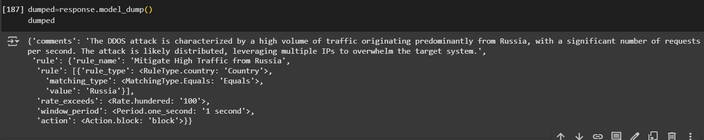

## Nikhil's Progress 

- Started working on the Autonomous Report Generation Agent and defining its Output signature , to be later deployed as a rule in the API security backend ( 29 / 04 / 2025 )

- obtained API key for Open AI and ran the Agent Code to generate Rules when a DDOS attack has been identified 

- More complications have presented themselves , The Deep learning model and the packet capture tool have been trained on the low level packet data and not HTTP log data . Therefore I will need to manually extract the following contents from each packet so that the Agent can Create a rule automatically for the network : IP , Country , HTTP Method , ASN , User Agent , Cookie , etc . Will have to write code to manually extract these features from the HTTP payload . 

- in parallel created a plan on how to deploy the DDOS and Bot agents using flask 

- Coordinating with yogesh with the Log input , changing the deep learning model's input 

- The Agent is 80% finished and based on initial runs , it can successfully generate Rules Autonomously when a DDOS attack is detected . 

## Demo 

### Output Generated Rule 

## Issues 
- Require DDOS and Bot network logs from Yogesh , delays in delivery of logs
- looking into how I can simulate a DDOS attack to test out the model and the agent ( thinkking about building a simulation script using the network logs provided by yogesh to test the workking of the agent)

