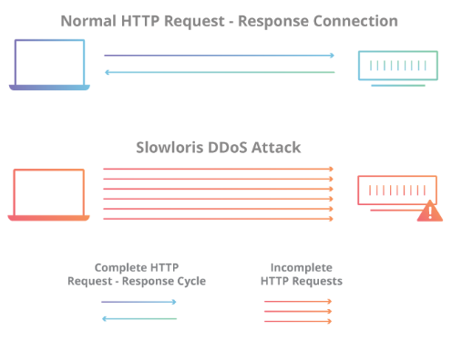
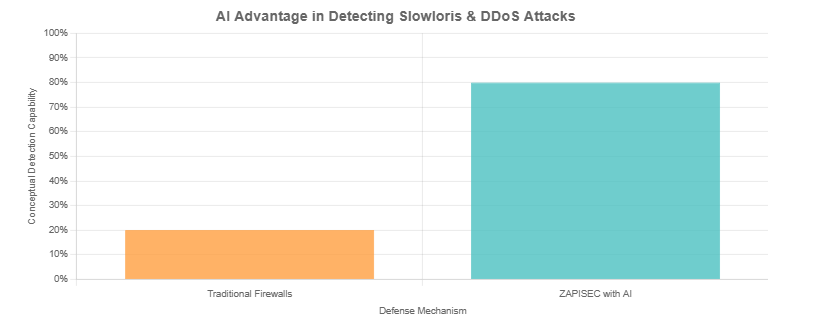
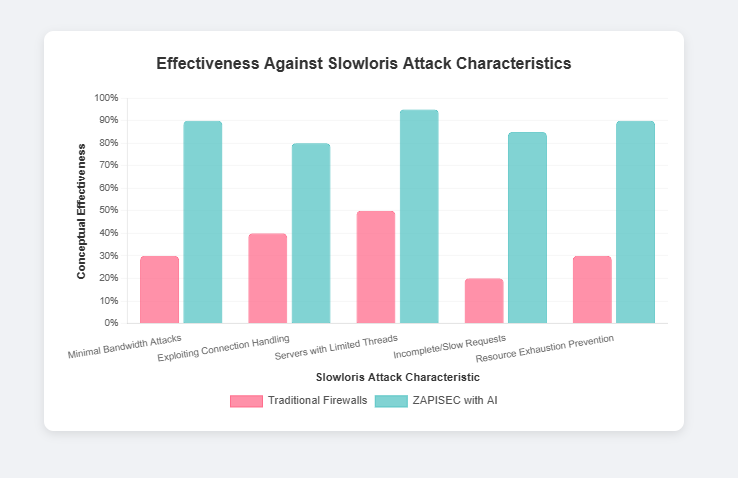
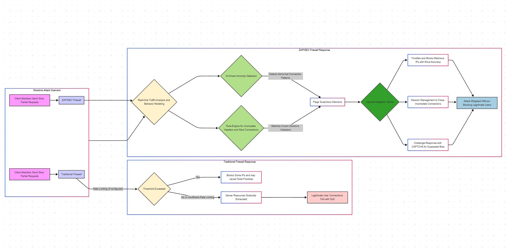
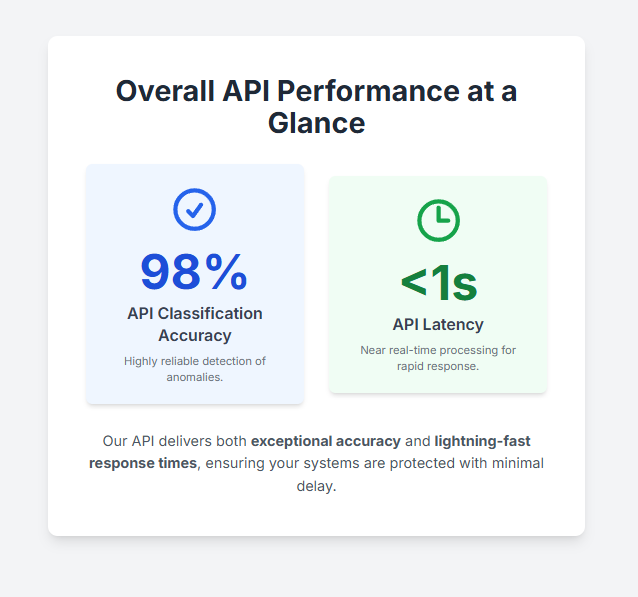

# Understanding the Slowloris DDoS Attack & Leveraging Generative AI for Anomaly Detection

## Understanding the Slowloris DDoS Attack & Leveraging Generative AI for Anomaly Detection with ZAPISEC

In today’s hyperconnected web ecosystem, security teams face a wide spectrum of Distributed Denial-of-Service (DDoS) threats — from volumetric floods to stealthy, low-and-slow application-layer attacks. One such insidious threat is the Slowloris attack, which quietly exhausts server resources by holding connections open indefinitely. At ZAPISEC, our approach to stopping threats like Slowloris doesn’t rely solely on static signatures or rate limiting — it’s powered by AI-driven anomaly detection, a core component of our firewall and monitoring platform.

### 🐢 What is a Slowloris Attack?

The Slowloris attack is a Layer 7 (Application Layer) DDoS method that targets HTTP servers by opening multiple simultaneous connections and sending partial requests very slowly. Unlike traditional DDoS attacks that bombard a server with traffic, Slowloris sends headers byte-by-byte, deliberately never completing the request. This forces the server to keep these sockets open — eventually consuming all available threads and crashing legitimate connections.

**Key characteristics:**

* Uses minimal bandwidth (difficult to detect via volume-based defenses)

* Exploits connection handling mechanisms of web servers

* Particularly effective against servers with limited threading capacity (e.g., Apache)

### 🔐 How ZAPISEC Defends Against Slowloris

ZAPISEC provides enterprise-grade Layer 7 DDoS protection, specifically designed to handle advanced application-layer attacks like Slowloris. The defense strategy incorporates:

#### ✅ Real-time Traffic Analysis & Request Behavior Modeling

ZAPISEC continuously monitors incoming traffic for anomalies. By evaluating parameters like:

* HTTP Request Rate

* Response Time Deviation

* Connection Lifecycle Patterns

* Incomplete Request Headers

our anomaly detection engine can identify telltale signs of Slowloris activity.

#### ✅ Rule-Engine with 7000+ AI-Tuned Signatures

The L7 DDoS Mitigation Core Rules embedded in ZAPISEC’s engine include logic to block:

* Incomplete or malformed HTTP headers

* Suspiciously long-lived connections with delayed data transfers

* Uncommon request sequences and header behavior patterns

This allows ZAPISEC to detect and mitigate application-layer threats before they saturate your infrastructure.

### 🧠 AI-Driven Anomaly Detection: Catching What Static Rules Miss

Traditional firewalls often fail to detect sophisticated, low-footprint attacks like Slowloris due to their signature-less nature. ZAPISEC’s Anomaly Detection Service solves this by using Generative AI and statistical models to analyze and classify traffic in real time.

   

**How it works:**

* Models learn normal behavior across your APIs and endpoints.

* Any deviations — such as a spike in half-open requests or prolonged response times — are flagged instantly.

* Security teams receive real-time alerts with contextual insights, enabling rapid investigation and mitigation.

You can also set custom thresholds, giving your team flexibility in tuning detection precision and reducing false positives.

### 🚦 Layered Mitigation Tactics

ZAPISEC doesn’t just detect — it acts. Once a Slowloris-like anomaly is flagged, the platform initiates automated responses such as:

* Throttling or blocking IPs exhibiting abnormal connection behavior

* Geo-fencing traffic from high-risk regions

* Session management to clean up long-held connections

* Challenge-response validations (e.g., CAPTCHA) for suspected bot traffic

These multi-pronged controls ensure Slowloris attacks are neutralized without affecting legitimate users.

### 📊 Visibility That Empowers

Through ZAPISEC’s centralized dashboard, DevSecOps teams gain deep visibility into ongoing anomalies, traffic trends, and blocked threats. You can:

* Visualize HTTP connection anomalies in real time

* Drill down into header-level data for slow requests

* Correlate incidents with bot scores and IP reputation indicators

This level of insight turns reactive mitigation into proactive defense.

### 🔍 Summary

Slowloris represents the kind of stealthy, sophisticated threat that demands more than basic defenses. With ZAPISEC, you're protected by a firewall platform that:

* Detects Slowloris patterns using AI-based anomaly detection

* Enforces layered mitigation strategies with zero latency impact

* Adapts continuously via machine learning and rulebook tuning

In the battle against modern DDoS threats, ZAPISEC ensures your applications stay online, resilient, and secure.

ZAPISEC — Where next-gen firewall protection meets AI intelligence.
Defend smarter. Detect sooner. Disrupt threats before they disrupt you.

For more technical insights, contact Cyberultron Consulting or explore how ZAPISEC can be integrated into your existing CI/CD security workflow.