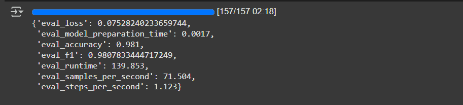
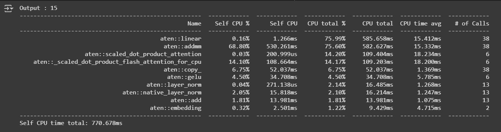
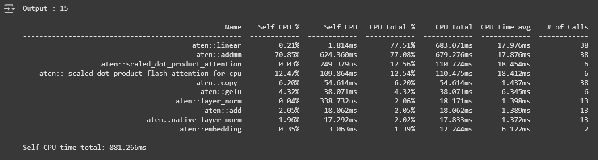

## Nikhil's Prgress 

- Completed model training using 50000 reords of formatted packet data and achieved an accuracy of 0.98 ( 98 %) 
- Did a short course and started brainstorming the agentic framework ( but require inputs regarding the end product )
- Started Work on building and testing the DDOS agent workflow 
- Coordinated with Yogesh from blockcube team to understand the product better and also understand where the AI agent automations could be inserted 
- Yogesh raised the concern overincreasing latency , so calculated latency of the model on raw traffic packets
- achieved an overall latency of **770 ms** using Google Colab T4 GPU
 
- achieved an overaly latency of **882 ms** using Google Colab CPU 

- currently working on developing the Agent Graph . 
- Looking into Autonomous rule generation , report generation and some other applications for application into DDOS and BOT protection . But still confused about what the expected end result is . 
- potential applications of Agentic AI in DDOS and BOT protections :
 - Generating a comprehensive report on the Attack after detection so that the user can understand the behaviours of the attack and the appropriate reponse 
 - Generating suggestions for Rules that can be applied to the DDOS or BOT protection attack before deploying them on the API security engine 

### Requirements :
1. Open AI credits 
2. Clearly defined feature requirements for the AI agent , given the input . 