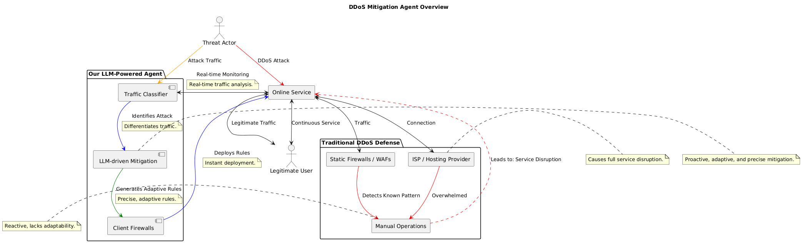

# Beyond Blackholes: How Our LLM-Powered DDoS Mitigation Agent Stops Even the Toughest Attacks

The digital landscape is under siege. Distributed Denial of Service (DDoS) attacks, once a sporadic nuisance, have transformed into a relentless and sophisticated threat, capable of crippling online operations and inflicting severe financial and reputational damage. Traditional defenses, often reactive and rigid, are proving increasingly inadequate against today's adaptive adversaries. Methods such as "blackholing," while a last resort, signify a failure of proactive defense, leading to complete service disruption for legitimate users. A new paradigm in cybersecurity is urgently required. This report introduces Our LLM-Powered DDoS Mitigation Agent as a transformative solution, moving beyond blunt, disruptive measures to offer intelligent, adaptive, and proactive defense that ensures legitimate traffic flows unimpeded while neutralizing even the most complex threats.

## The Escalating DDoS Threat Landscape: A New Era of Cyber Warfare

The current year has witnessed an unprecedented surge in DDoS activity, underscoring the critical need for advanced mitigation strategies. Data from Vercara's UltraDDoS Protect reveals a staggering **16,073% increase in DDoS attacks compared to 2023**, with a total of **270,405 attacks detected in 2024**, translating to a monthly average of approximately **17,486 attacks** [1]. This dramatic escalation indicates that DDoS is no longer an occasional, isolated incident but a pervasive and rapidly accelerating threat. While record-breaking events, such as a single assault in October 2024 peaking at an astounding **1.4 Tbps in bandwidth and 459.10 million packets per second**, capture headlines, the majority of incidents (approximately **75%**) are smaller in scale, ranging between 0.0 and 0.5 Gbps [1]. The sheer volume and frequency of these attacks mean that virtually any organization with an online presence is a potential target at any given moment. This pervasive nature necessitates a fundamental shift from reactive, incident-response-focused security to continuous, automated, and highly scalable protection, as manual interventions or slow, static defenses are simply overwhelmed by such a torrent of malicious activity.

The evolution of attack vectors further complicates the defense landscape. Carpet bombing attacks, which distribute malicious traffic across numerous IP addresses simultaneously, accounted for nearly **82.78% of all attacks and surged by 238.45% year over year** [1]. These attacks are particularly challenging to mitigate due to their dispersed nature [2]. Furthermore, the complexity of attacks is increasing, with **45.14% of incidents involving multiple vectors** [1], demonstrating the diverse and sophisticated approach adopted by threat actors. Even older techniques are seeing a resurgence, such as DNS Amplification attacks, which experienced a **4,446% increase and were utilized in over 26% of attacks** [2], exploiting the DNS protocol to consume network resources. Common attack vectors include SYN floods, which exploit the TCP handshake by sending SYN packets without completing the connection, thereby exhausting server resources and filling connection state tables [3]. UDP floods involve sending high rates of spoofed UDP packets to random ports, overwhelming network elements [3]. HTTP/S floods, on the other hand, use seemingly legitimate GET or POST requests to overwhelm web services or applications, often proving difficult to detect due to their resemblance to normal traffic [3].

A significant enabler of these attacks is the proliferation of botnets, vast networks of compromised devices ranging from personal computers and servers to Internet of Things (IoT) devices [5]. Attackers exploit vulnerabilities, such as weak authentication and Telnet vulnerabilities, in these devices for bot recruitment, dramatically increasing attack volume and making attribution difficult [5]. The increasing sophistication, multi-vector nature, and adaptability of these attacks, fueled by readily available compromised IoT devices, render static, single-point, or signature-based defenses largely ineffective. A defense mechanism must be equally, if not more, adaptive and intelligent than the attacks themselves to counter this evolving threat.

The impact of DDoS attacks extends far beyond technical disruption, inflicting devastating financial and reputational damage. According to the Ponemon Institute, the average downtime due to a DDoS attack is **54 minutes**, with an average cost of **$22,000 per minute**, leading to an average cost of nearly **$1.2 million per attack** [7]. Beyond these direct costs, businesses face significant intangible damages, including lost business opportunities, severe brand damage, customer attrition, and in extreme cases, the potential for complete business closure [7]. The targeting of specific sectors highlights the economic motivations behind these attacks. The Financial Services sector, for instance, continued to experience a surge in attacks in 2024, becoming the second most targeted industry (**25.44% in 2024, 29% in H1 2024**) after Communication Service Providers (**69.39% in 2024, 38% in H1 2024**) [1]. This pattern suggests clear economic motivations and geopolitical tensions influencing attack targets [2]. The ability of robust solutions, such as Vercara UltraDDoS Protect, to prevent significant downtime—over **121,791 hours saved in 2024 and 34,000 hours in H1 2024** [1]—underscores the tangible value of effective mitigation. The astronomical per-minute cost of downtime directly links DDoS attacks to severe financial losses and business continuity risks. This transforms DDoS mitigation from a mere IT security concern into a critical business continuity and risk management imperative. Investing in advanced, proactive DDoS protection is no longer optional but a strategic business decision to safeguard revenue, reputation, and operational resilience.

| Metric                        | Data Point             | Source |
| :---------------------------- | :--------------------- | :----- |
| Overall Attack Volume (2024)  | 270,405 attacks        | 1      |
| Year-over-Year Increase       | 16,073% (compared to 2023) | 1      |
| Monthly Average Attacks       | ~17,486                | 1      |
| Peak Attack Bandwidth         | 1.4 Tbps               | 1      |
| Peak Attack Packets/Second    | 459.10 Mpps            | 1      |
| Carpet Bombing Prevalence     | 82.78% of attacks      | 1      |
| Multi-Vector Attacks          | 45.14%                 | 1      |
| DNS Amplification Resurgence  | 4,446% increase        | 2      |
| Average Cost per Minute Downtime | $22,000                | 7      |
| Average Cost per Attack       | ~$1.2 Million          | 7      |
| Top Targeted Industry         | Communication Service Providers (69.39%) | 1      |
| Second Targeted Industry      | Financial Services (25.44%) | 1      |

**Table 1: The Evolving DDoS Threat Landscape (2024)**

## Beyond Static Rules: Why Traditional Defenses Are Failing

The fundamental limitations of conventional DDoS mitigation strategies stem from their reactive nature and reliance on predefined patterns [9]. Traditional methods typically employ pre-configured rules, known attack signatures, or fixed thresholds [9]. While these approaches can be effective against known, static threats, they are inherently limited against the novel, polymorphic, and continuously evolving DDoS attacks prevalent today [5]. Signature-based detection, for instance, requires a predefined pattern match, rendering it ineffective against "zero-day" or previously unseen attacks [10]. Similarly, threshold-based detection often generates false positives during legitimate traffic spikes, such as those caused by viral content or marketing campaigns, or conversely, fails to detect sophisticated, low-and-slow attacks that deliberately stay below fixed thresholds [9]. This approach lacks the adaptability to dynamically adjust to changing network conditions [10]. This reactive model, where systems detect a known pattern and then block it, creates an inherent detection gap. Attackers are polymorphic, adaptive, and utilize multi-vector approaches, meaning the "race to update signatures" is a losing one against adversaries who may themselves be leveraging advanced techniques. This reactive nature ensures traditional systems are always a step behind, capable only of defending against what they have encountered before, leaving organizations vulnerable to the next wave of attacker innovation.

A common misconception is that basic perimeter defenses provide adequate DDoS protection. Firewalls, for example, cannot protect against complex DDoS attacks and can even act as DDoS entry points, as malicious traffic often passes directly through open ports intended for legitimate users [8]. Similarly, Internet Service Providers (ISPs) generally lack the granular ability to detect, analyze, and mitigate DDoS attacks before they impact customer services, as their primary role is connectivity, not deep threat analysis for individual customers [8]. Relying solely on a hosting provider for DDoS protection is often insufficient, necessitating specialized DDoS solutions [8]. This belief that firewalls, ISPs, or hosting providers offer comprehensive DDoS protection creates a dangerous false sense of security. These entities have different core functions and often lack the specialized capabilities, such as granular detection, detailed analysis, and precise mitigation, required for modern DDoS defense. This leads to a significant "responsibility gap" where organizations mistakenly assume they are protected when they are not. Consequently, organizations must take direct ownership of their DDoS defense strategy and invest in specialized, dedicated solutions that go beyond basic network infrastructure protection, as relying on generic security measures is akin to bringing a knife to a gunfight against a sophisticated adversary.

Furthermore, the reliance on manual intervention and drastic measures like blackholing highlights the inefficiencies of traditional approaches. Once a DDoS attack is detected, traditional mitigation often involves the manual creation and deployment of firewall rules, custom-made for the current attack [11]. This is a slow, resource-intensive process, particularly against rapidly evolving attacks. Blackholing, a typical ISP method to stop an attack, while effective at blocking malicious traffic, also renders the targeted site completely inaccessible to all legitimate traffic, resulting in **100% downtime** for the duration of the mitigation [4]. This "scorched earth" approach prioritizes network stability over service availability, essentially achieving the attacker's goal of denial of service, albeit in a controlled manner. Additionally, security administrators face significant challenges in managing extensive blacklisting and whitelisting records across multiple files for various applications [9]. The reliance on manual rule generation introduces human latency into a battle where milliseconds matter; attackers can adapt faster than human operators can analyze and deploy new rules. Blackholing, while stopping the attack, causes complete service disruption, representing unacceptable collateral damage for businesses reliant on their online presence. The current threat landscape demands automated, real-time, and precise mitigation that minimizes human intervention and avoids collateral damage to legitimate users. Any solution that causes significant downtime, even during mitigation, fails to meet the core business objective of continuous availability.

## Our LLM-Powered Advantage: Intelligent, Adaptive DDoS Mitigation

   

The limitations of traditional defenses have spurred a critical shift in cybersecurity research towards AI-based detection and mitigation [11]. This shift is crucial for addressing the growing complexity and adaptability of DDoS attacks. AI-based approaches, particularly Machine Learning (ML) and Deep Learning (DL), demonstrate superior performance in detecting previously unseen attacks compared to signature-based methods [12]. The core limitation of traditional methods is their reliance on known patterns or fixed thresholds. AI, and by extension, Large Language Models (LLMs), overcome this by learning normal behavior and identifying anomalies [10]. This capability allows for the detection of novel, polymorphic, and multi-vector attacks that do not fit a predefined signature. This represents a fundamental shift from reactive pattern matching to proactive behavioral intelligence, enabling true zero-day DDoS protection.

Our platform's Traffic Classifier is the initial line of defense, rapidly identifying DDoS activity. This component leverages advanced analytics and real-time traffic monitoring to detect abnormal patterns indicative of an attack in its early stages [5]. It meticulously analyzes various factors, including packet rates, packet sizes, traffic sources, protocols, user agents, and geographic origins [9]. This comprehensive analysis allows it to differentiate between legitimate spikes in traffic and actual malicious activity, minimizing false positives [10]. Rapid and accurate identification of DDoS activity is the first critical step; by leveraging advanced classification techniques, the system can distinguish between legitimate traffic surges and malicious activity, enabling faster mitigation. The ability to detect "shorter attack activity" that might evade static rate-limiting is crucial for early intervention [9]. This early detection significantly reduces the attack's potential impact, minimizing downtime and resource exhaustion, and providing a crucial head start for mitigation.

Once an attack is identified, the LLM-driven DDoS Mitigation Agent, the brain of the operation, takes over. It goes beyond simple detection to analyze real-time attack patterns with unparalleled depth. The LLM leverages its understanding of network protocols, traffic flows, and historical attack data to comprehend the intent and mechanisms of the ongoing attack, even if it is novel or polymorphic [5]. This sophisticated analysis includes identifying specific attack vectors, such as SYN floods, UDP floods, or HTTP floods, along with their unique characteristics and the attacker's evolving tactics. Unlike traditional systems that merely match patterns, an LLM can process vast amounts of real-time network data, understand the context of the traffic, and infer the behavioral intent of the attack. This allows it to go beyond simply identifying a known signature to understanding how a sophisticated, evolving attack is behaving and targeting specific resources, even if the exact signature has not been encountered before. This capability hints at a form of predictive analysis based on observed patterns, leading to more precise and adaptive mitigation that can anticipate attacker moves rather than merely reacting to them.

The core differentiator of this solution is its adaptive rule generation, where the LLM-driven agent crafts precise, dynamic network-level mitigation rules in real-time. This capability stands in stark contrast to the slow, manual updates characteristic of traditional systems [11]. The LLM can generate concrete and highly targeted rules, such as dropping packets based on specific flags or protocol anomalies (e.g., discarding malformed or suspicious packets that deviate from legitimate protocol behavior), activating SYN cookies as a defense mechanism against SYN floods to validate TCP connections without exhausting server memory, or implementing dynamic IP blocking and rate limiting to intelligently block or rate-limit traffic from identified malicious source IPs or subnets while allowing legitimate traffic from those same ranges to pass if patterns change. For application-layer attacks like HTTP/S floods, the LLM can generate specific rules to identify and block malicious HTTP headers [4] or suspicious request patterns, while ensuring valid user interactions remain unaffected. These rules are not static; they adapt continuously as the attack patterns evolve, effectively countering polymorphic and multi-vector assaults. The ability of LLMs to generate precise and adaptive rules in real-time is revolutionary. Traditional systems either apply blunt force or rely on predefined, often outdated, rules. LLMs, however, can analyze the attack's nuances and generate highly targeted countermeasures that minimize false positives and ensure legitimate traffic flow. This automated counter-adaptation directly addresses the problem of attackers constantly changing their vectors and methods [1]. This capability transforms DDoS mitigation from a reactive, disruptive process into a seamless, intelligent defense that maintains service availability even under severe attack.
   
The efficacy of this intelligent mitigation is further enhanced by a unified architecture that ensures fast deployment of these dynamically generated rules to the Client System's firewalls and routers. This seamless integration eliminates any delay between rule generation and enforcement, which is crucial in the face of high-volume, fast-moving DDoS attacks. Even the most intelligent rule generation is ineffective if deployment is slow. The emphasis on a unified architecture and fast deployment demonstrates that the solution has addressed the operational challenge of instantly implementing new rules. This directly counters the problem of slow manual updates [11], ensuring that the adaptive intelligence of the LLM translates into real-world, real-time protection, thereby minimizing the window of vulnerability for the targeted system.

| Feature/Capability            | Traditional Defenses (e.g., Static Rules, Blackholing, Firewalls) | Our LLM-Powered Mitigation           |
| :---------------------------- | :---------------------------------------------------------------- | :----------------------------------- |
| Detection Method              | Signature/Threshold-based                                       | Behavioral Analysis, Anomaly Detection, Pattern Recognition [10] |
| Adaptability to New Attacks   | Low (ineffective against novel/polymorphic)                       | High (learns and adapts in real-time) [11] |
| Mitigation Speed              | Slow (manual updates, human latency)                              | Real-time, Automated [11]            |
| False Positive Rate           | High (during legitimate traffic spikes)                           | Low (precise, context-aware analysis) [9] |
| Impact on Legitimate Traffic  | High (blackholing, collateral damage)                             | Minimal (surgical, precise rule application) [4] |
| Scalability                   | Limited (on-premises, static capacity)                            | Highly Scalable (cloud-based, adaptive capacity) [9] |
| Rule Generation               | Manual, Pre-configured                                            | Automated, Dynamic, Adaptive [11]    |
| Overall Efficacy against Modern Attacks | Low/Reactive                                                    | High/Proactive                       |

**Table 2: Traditional DDoS Defenses vs. Our LLM-Powered Mitigation**

## Real-World Resilience: A Hypothetical Case Study in Action

To illustrate the practical benefits of this advanced approach, consider a hypothetical scenario: a critical online service, such as an e-commerce platform during a peak sales event, faces a sophisticated, multi-vector DDoS attack. The initial phase of the assault involves a volumetric SYN flood combined with a UDP amplification attack, designed to overwhelm the network infrastructure. As these initial defenses struggle, the attacker adapts, shifting to a low-and-slow HTTP flood, meticulously mimicking legitimate user behavior to bypass static rate limits.

In this scenario, Our LLM-Powered DDoS Mitigation Agent demonstrates its superior capabilities. The Traffic Classifier rapidly identifies the initial volumetric attack, distinguishing it from legitimate traffic surges. The LLM-driven DDoS Mitigation Agent immediately begins analyzing the real-time patterns, quickly discerning the multi-vector nature of the assault. It identifies the SYN flood's half-open connections and the UDP flood's spoofed packets. As the HTTP flood emerges, the LLM adapts its analysis, recognizing the subtle behavioral anomalies even within seemingly legitimate HTTP requests.

In milliseconds, the LLM crafts and deploys precise, dynamic rules. For the SYN flood, it activates SYN cookies and drops malformed SYN packets. For the UDP amplification, it implements intelligent rate-limiting and IP blocking for the malicious sources. Crucially, for the HTTP flood, it might generate rules to challenge suspicious user agents, block specific header combinations, or apply behavioral rate-limiting to individual sessions exhibiting anomalous patterns, all without impacting legitimate users. The attack is swiftly mitigated with minimal disruption to legitimate users. The e-commerce site remains online, transactions continue seamlessly, and brand reputation is preserved. This outcome directly translates the abstract technical benefits of LLMs into concrete, relatable business outcomes, demonstrating how the technology prevents financial loss, reputational damage, and operational disruption. The focus on "minimal disruption" and "transactions continue" directly addresses the core concerns of businesses reliant on online presence. This case study provides compelling evidence that the solution is not merely technologically advanced but a strategic asset that safeguards the very essence of an online business: uninterrupted service delivery.

## Conclusion: Secure Your Digital Future with Intelligent DDoS Protection

The escalating and increasingly complex nature of DDoS attacks demands a fundamentally new approach to cybersecurity. Traditional, reactive methods are no longer viable in a landscape dominated by adaptive and polymorphic threats. The evidence clearly indicates that relying on static rules, basic perimeter defenses, or manual interventions leaves organizations vulnerable to significant financial losses and irreparable brand damage.

Our LLM-Powered DDoS Mitigation Agent represents a paradigm shift in defense. It offers proactive intelligence, anticipating and adapting to threats before they can inflict damage. Its adaptive defense capabilities ensure continuous learning and evolution in lockstep with attack patterns. Through surgical precision, it mitigates threats without impacting legitimate users, effectively moving "beyond blackholes" to preserve service availability. This intelligent defense provides unmatched resilience, ensuring continuous online presence and safeguarding vital revenue streams. To protect digital assets and ensure uninterrupted operations in the face of modern cyber threats, exploring advanced, intelligent DDoS protection is imperative.

---

## Works cited

[1] Annual DDoS Report 2024 Trends And Insights - Vercara - DigiCert, accessed on June 5, 2025, https://vercara.digicert.com/resources/annual-ddos-report-2024-trends-and-insights
[2] Vercara Data: 186% increase in DDoS Attacks in First Half of 2024, accessed on June 5, 2025, https://vercara.digicert.com/news/vercara-data-186-increase-in-ddos-attacks-in-first-half-of-2024
[3] DDoS Glossary: Common DDoS Attack Types You Should Know - Allot, accessed on June 5, 2025, https://www.allot.com/ddos-attack-glossary/
[4] DDoS Quick Guide - CISA, accessed on June 5, 2025, https://www.cisa.gov/sites/default/files/publications/DDoS%20Quick%20Guide.pdf
[5] Comprehensive Guide to Distributed Denial-of-Service (DDoS) Attacks and Protection Strategies - CertLibrary Blog, accessed on June 5, 2025, https://www.certlibrary.com/blog/comprehensive-guide-to-distributed-denial-of-service-ddos-attacks-and-protection-strategies/
[6] Modern DDoS Threats and Countermeasures: Insights into Emerging Attacks and Detection Strategies - arXiv, accessed on June 5, 2025, https://arxiv.org/html/2502.19996v1
[7] DDoS Edge Protect: Myth vs Fact - Segra, accessed on June 5, 2025, https://www.segra.com/wp-content/uploads/2024/11/DDoS_MythVSFact_2024.pdf
[8] Infographic 10 DDoS Myths - Corero, accessed on June 5, 2025, https://go.corero.com/hubfs/3.%20Website%20Content/1.%20Asset%20Downloads/5.%20Infographics/10-DDoS-Myths-Infographic.pdf
[9] What is DDoS Mitigation & How Does It Work? | Indusface Blog, accessed on June 5, 2025, https://www.indusface.com/blog/ddos-mitigation/
[10] ML Beginner's Guide to DDoS Attack Detection model - Labellerr, accessed on June 5, 2025, https://www.labellerr.com/blog/ddos-attack-detection/
[11] Detecting and Mitigating DDoS Attacks with AI: A Survey - arXiv, accessed on June 5, 2025, https://arxiv.org/html/2503.17867v1
[12] From Signatures to AI: A Comprehensive Review of DDoS Detection Strategies in IoT & SDN, accessed on June 5, 2025, https://journals.mmupress.com/index.php/ijoras/article/view/922