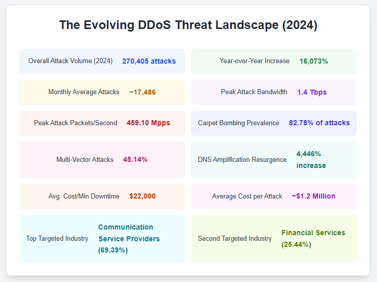
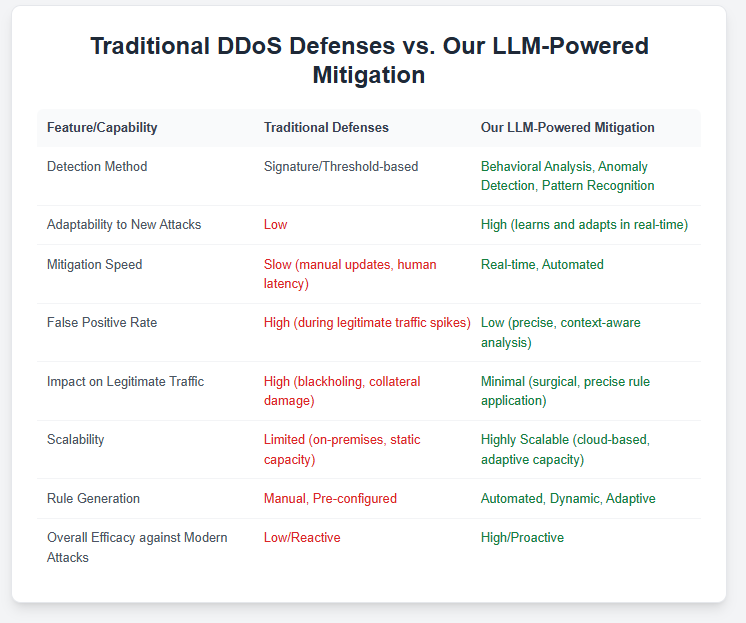

## Beyond Blackholes: How Our LLM-Powered DDoS Mitigation Agent Stops Even the Toughest Attacks

The digital world faces an escalating threat: sophisticated DDoS attacks. Traditional defenses like "blackholing" offer only reactive, disruptive measures, leading to complete service outages. A new approach is vital. Our **LLM-Powered DDoS Mitigation Agent** provides intelligent, adaptive, and proactive defense, ensuring legitimate traffic flows while neutralizing complex threats.

---

### The Escalating DDoS Threat: A New Era of Cyber Warfare

DDoS activity has surged unprecedentedly this year. Vercara's UltraDDoS Protect reported a **16,073% increase** in attacks compared to 2023, totaling **270,405 attacks** in 2024, averaging **17,486 monthly**. While a single October 2024 assault peaked at **1.4 Tbps** and **459.10 Mpps**, roughly **75%** of incidents are smaller (**0.0-0.5 Gbps**).

Attack vectors are evolving: **carpet bombing attacks** (distributing traffic across IPs) accounted for nearly **82.78%** of attacks and surged by **238.45%** year-over-year. **45.14%** of incidents involved multiple vectors. Even older techniques are resurfacing, with **DNS Amplification attacks** increasing by **4,446%** and used in over **26%** of attacks. Common vectors include SYN floods, UDP floods, and HTTP/S floods. Botnets, networks of compromised devices from PCs to IoT, fuel these attacks, making static, signature-based defenses ineffective.

DDoS attacks cause significant financial and reputational damage. The Ponemon Institute reports an average downtime of **54 minutes**, costing **$22,000 per minute**, totaling nearly **$1.2 million per attack**. Beyond direct costs, businesses face lost opportunities and severe brand damage. The **Financial Services** sector is the second most targeted (**25.44%** in 2024), after **Communication Service Providers** (**69.39%**). Solutions like Vercara UltraDDoS Protect prevented over **121,791 hours** of downtime in 2024. This makes DDoS mitigation a critical business continuity imperative.

  

---

### Beyond Static Rules: Why Traditional Defenses Are Failing

Traditional DDoS mitigation relies on reactive, predefined patterns, making them ineffective against novel, polymorphic, and evolving attacks. Signature-based detection fails against "zero-day" attacks, and threshold-based detection often generates false positives or misses sophisticated, low-and-slow attacks. This reactive model is always a step behind.

Basic perimeter defenses like firewalls and ISPs often lack the granular capability for effective DDoS protection, creating a dangerous false sense of security. Relying on them is insufficient; specialized solutions are needed.

Furthermore, manual intervention and drastic measures like **blackholing** are inefficient. Manual rule creation is slow against rapid attacks. Blackholing, while stopping malicious traffic, renders the site **100% inaccessible** to legitimate users. The current threat demands automated, real-time, and precise mitigation that avoids collateral damage.

---

### Our LLM-Powered Advantage: Intelligent, Adaptive DDoS Mitigation

AI-based detection, especially with Machine Learning (ML) and Deep Learning (DL), offers superior performance against unseen attacks. Our platform's **Traffic Classifier**, the initial line of defense, uses advanced analytics to detect abnormal patterns early by analyzing packet rates, sizes, sources, protocols, user agents, and geographic origins. This minimizes false positives and ensures rapid identification.

  

  

The **LLM-driven DDoS Mitigation Agent**, the brain of the operation, deeply analyzes real-time attack patterns. It understands network protocols, traffic flows, and historical data to comprehend attack intent and mechanisms, even for novel or polymorphic threats. Unlike traditional systems, an LLM processes vast amounts of real-time data, understanding context and inferring behavioral intent.

The core differentiator is its **adaptive rule generation**. The LLM crafts precise, dynamic network-level mitigation rules in real-time. It generates targeted rules, like dropping malformed packets, activating SYN cookies, or implementing dynamic IP blocking and rate limiting. For HTTP/S floods, it identifies and blocks malicious HTTP headers or suspicious request patterns without affecting legitimate users. These rules continuously adapt as attack patterns evolve.

A **unified architecture** ensures fast deployment of these rules to client system firewalls and routers, eliminating delays between generation and enforcement.

  

---

### Real-World Resilience: A Hypothetical Case Study

Imagine an e-commerce platform during a peak sales event facing a multi-vector DDoS attack (SYN flood, UDP amplification, then a low-and-slow HTTP flood). Our LLM-Powered Agent rapidly identifies the initial volumetric attack. The LLM then analyzes the real-time patterns, discerning the multi-vector nature and subtle anomalies of the HTTP flood. In milliseconds, it crafts and deploys precise, dynamic rules: activating SYN cookies, dropping malformed packets, implementing intelligent rate-limiting and IP blocking for malicious sources, and challenging suspicious user agents or blocking specific HTTP headers. The attack is swiftly mitigated with minimal disruption, keeping the e-commerce site online and preserving brand reputation.

---

### Conclusion: Secure Your Digital Future with Intelligent DDoS Protection

The escalating complexity of DDoS attacks demands a new approach. Traditional, reactive methods are no longer viable. Our **LLM-Powered DDoS Mitigation Agent** offers proactive intelligence, anticipating and adapting to threats. Its adaptive defense ensures continuous learning and surgical precision, mitigating threats without impacting legitimate users. This intelligent defense provides unmatched resilience, safeguarding revenue and ensuring continuous online presence. Investing in advanced, intelligent DDoS protection is crucial to protect digital assets and ensure uninterrupted operations.